> Title: Unamanned Graound vehicles: Full area coverage path planning using Vison Based Area Decompostion
 Conference: Scheduled for ICRA 2025, at USA. 
Usage:

step1: clone the project and install requirements.txt.
step2: Change the PATH of occupancy grid map and map yaml.
step3: adjust parameters like surveillance range(based on your sensor range), max iterations, way-point optimization type, way-point dropout rate.
step4: excute surveillance.py -- cpu1 or cupm or gpu   note: cpu1 - single processing, cpum - multi processing(RECOMMENDED) , GPU

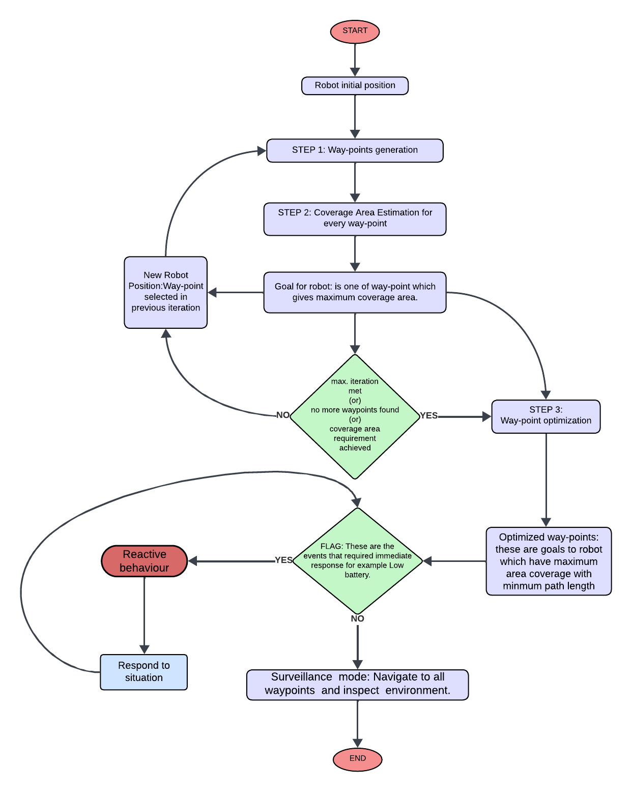

---------------------------------------Surveillance Algorithm-------------------------------------

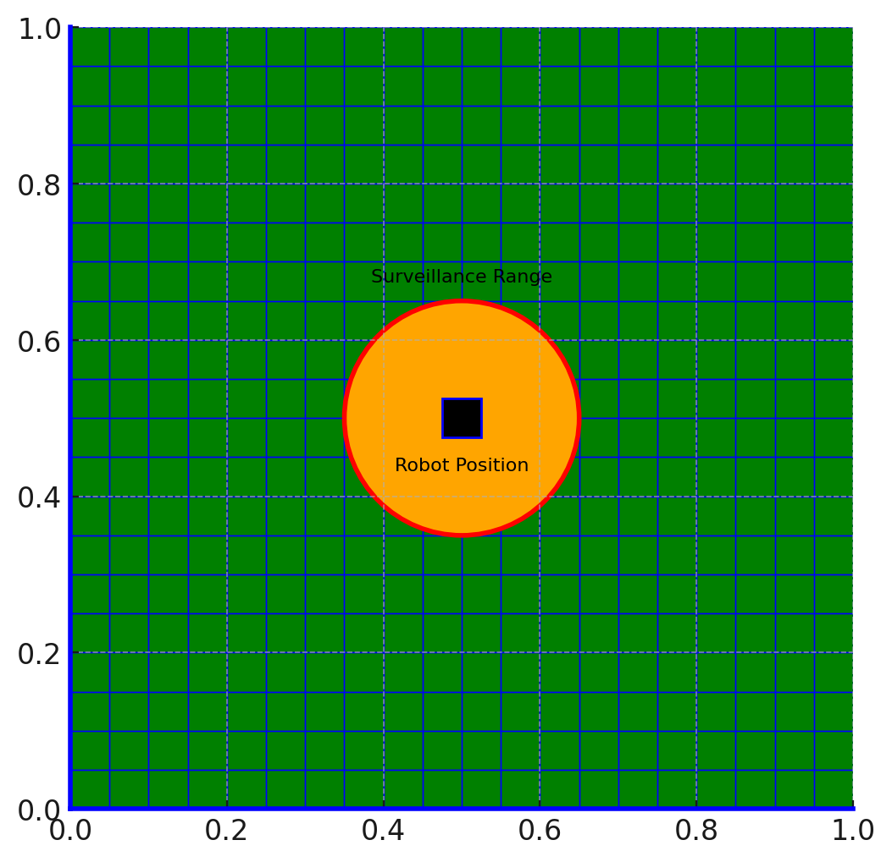

above figure demonestrates how frontiers are slected for surveillance algorithm, green is the unoccupied region and orange is the surveillance area that robot can cover from start position (estimated based on sensor range). red region is the frontier boundary (boundary that sepreats explored and unoccupied area).

example on how surveillance algorithm works:

let's use real time occupancy map as shown in figure

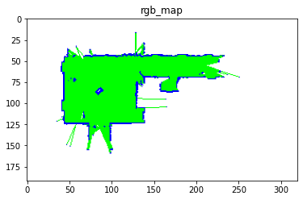

and table shows how this surveillance algorithm estimates goals such that surveillance area is maxmized with optimal path.

| Iteration | Goal      | Explored Area | Frontiers | CPU Execution Time (s) | GPU Execution Time (s) |
|-----------|-----------|---------------|-----------|------------------------|------------------------|
| 1         | (50, 50)  | 6.06          | 1         | 0.2277                 | 1                      |
| 2         | (62, 67)  | 13.08         | 50        | 9.1336                 | 3                      |
| 3         | (62, 88)  | 20.13         | 110       | 19.9720                | 5                      |
| 4         | (68, 108) | 27.37         | 161       | 29.4274                | 8                      |
| 5         | (89, 108) | 34.62         | 228       | 41.5267                | 11                     |
| 6         | (105, 95) | 41.64         | 293       | 53.3847                | 14                     |
| 7         | (82, 61)  | 48.37         | 352       | 64.1778                | 18                     |
| 8         | (103, 61) | 54.09         | 392       | 71.0921                | 20                     |
| 9         | (56, 125) | 59.08         | 414       | 74.8881                | 21                     |
| 10        | (56, 146) | 64.06         | 448       | 80.8565                | 24                     |
| 11        | (56, 167) | 69.61         | 461       | 83.2327                | 26                     |
| 12        | (56, 188) | 74.53         | 488       | 88.0545                | 27                     |
| 13        | (106, 120)| 79.03         | 502       | 90.4957                | 29                     |
| 14        | (56, 209) | 83.05         | 495       | 89.0060                | 28                     |
| 15        | (125, 89) | 86.16         | 501       | 90.0417                | 28                     |
| 16        | (76, 170) | 88.19         | 533       | 95.6528                | 30                     |
| 17        | (49, 104) | 89.01         | 526       | 94.4460                | 29                     |
| 18        | (83, 80)  | 89.76         | 496       | 89.9992                | 28                     |
| 19        | (84, 125) | 90.40         | 456       | 81.7659                | 26                     |
| 20        | (85, 95)  | 90.99         | 431       | 77.2387                | 25                     |

table shows within 10 iterations already explored more then 80% of toal area let's visualize graphs at each iteartion black area is explored are red dot is the selected frontier which maxmizes surveillance area from all frontiers at each iteration.

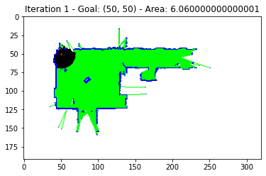
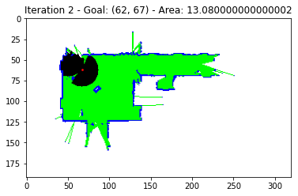
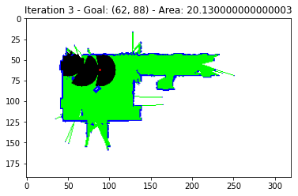
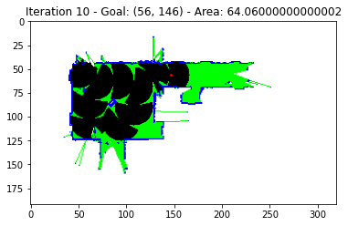
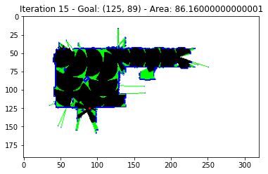
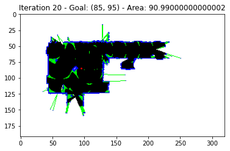

visualization of randomly selected subgraphs for 4 frontiers after 2 nd iteration 

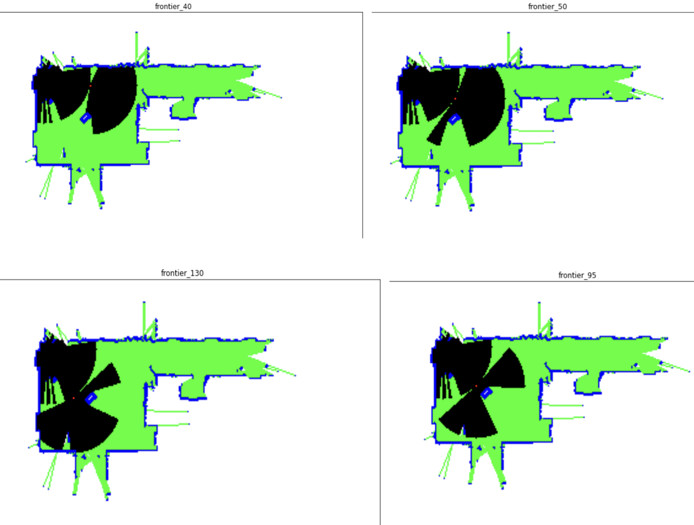

WAY-POINT OPTIMIZATION:

way-point optimization technique where final path optimized such that total path is minimized and surveillance area is maxmized

the grid shows path with out optimization

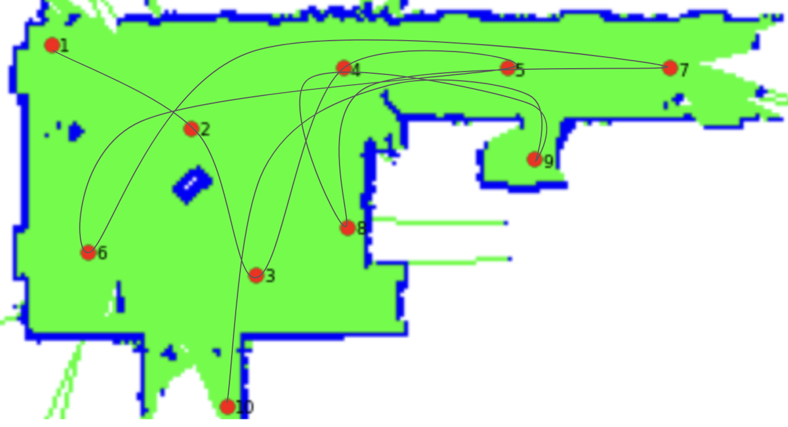

the grid with optimization 

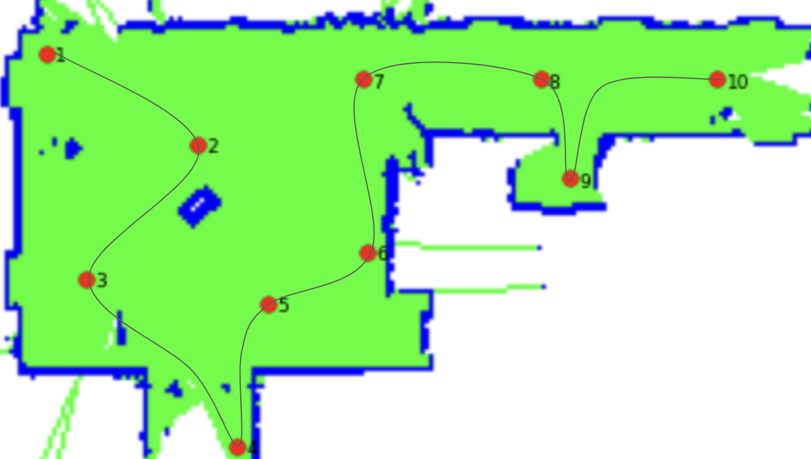

